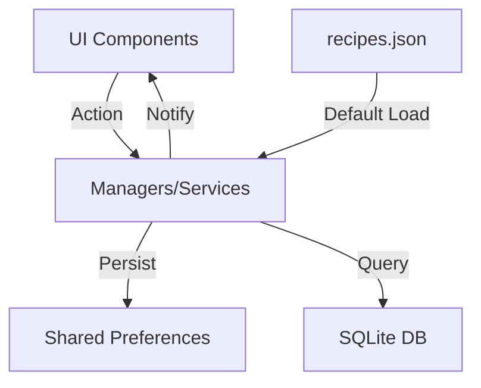

# Recetas - Complete App Overview

**Recetas** is a premium Flutter application designed for modern home cooks who value both functionality and aesthetic beauty. It transitions the traditional recipe box into a digital, AI-enhanced experience while maintaining a warm, organic feel.

---

## 🌟 Vision & Purpose
Recetas is born from the idea that cooking should be an inviting, tactile experience, even when digitized. The app focuses on **offline-first reliability**, **privacy-centric data management**, and a **premium visual language** that feels more like a physical cookbook than a utility app.

### Target Audience
- **Home Chefs:** Individuals looking for a beautiful way to organize their culinary repertoire.
- **Meal Planners:** Users who need to manage their weekly nutrition efficiently.
- **Diet-Conscious Users:** People with specific dietary restrictions (Gluten-Free, Vegan, etc.) who need a smart system to filter content.
- **Tech-Savvy Cooks:** Users who enjoy AI-assisted recipe generation and modern sharing methods like QR codes and deep links.

---

## 🍳 Focus & Key Features

### 1. Intelligent Recipe Management
- **Smart Ingredient Matching:** Highlights which ingredients the user already has and identifies what's missing.
- **Dietary Safeguards:** Real-time visual indicators (red dots) for recipes that don't match the user's dietary profile.
- **Multi-Level Organization:** A sophisticated folder and sub-folder system with custom icons for professional-grade categorization.
- **Rich Content Editing:** Full control over steps, detailed ingredient quantities, nutrition facts, and custom imagery.

### 2. AI-Powered Recipe Extraction (Vision AI)
- **OCR & Intelligent Parsing:** Users can take a photo of a physical cookbook or handwritten note, and the app uses **Google Gemini** or **OpenAI** to extract the title, ingredients, and steps into a structured format.
- **Provider Flexibility:** Support for Gemini 2.5 Flash (free/recommended), GPT-4o, and custom compatible endpoints (e.g., OpenRouter).
- **Interactive Review:** Extracted data is presented for review before being committed to the local database.

### 3. Sophisticated Meal Planning
- **Interactive Calendar:** A seamless weekly view for assigning meals.
- **Meal Templates:** Design "Weekly Staples" and apply them to any calendar range with one tap.
- **Categorized Planning:** Specific slots for Breakfast, Lunch, Dinner, and Snacks.
- **Progress Tracking:** Simple tap-to-complete actions to keep track of daily nutrition goals.

### 4. Data Sovereignty & Sharing
- **Offline-First:** All data lives on the device; no cloud account is required for core functionality.
- **Compressed Sharing:** Uses Gzip + Base64 encoding to share full recipes through tiny strings, QR codes, or custom `.receta` files.
- **Smart Import:** Detects conflicts during import and allows for merging or skipping duplicates.

### 5. Personalized Experience
- **User Profile:** Local identity with custom name, photo, and cumulative usage statistics.
- **Customizable Navigation:** Users can choose which features (Search, Saved, Planner) appear in their bottom navigation bar.
- **Cooking Mode:** Integrated **Wakelock** support to keep the screen active while the user is cooking.

---

## 🎨 Design System ("The Artisan Look")
*Recetas uses a curated design language to evoke a warm, organic kitchen environment.*

### Core Philosophy
- **Light Mode: "Artisan Bakery"** — Toasted parchment, rich creams, and earthy natural tones.
- **Dark Mode: "Rustic Organic Kitchen"** — Deep woods, truffle tones, and herbal sage accents.

### Color Palette
| Token | Light (Bakery) | Dark (Kitchen) | Usage |
| :--- | :--- | :--- | :--- |
| **Background** | `#EBE6DD` (Parchment) | `#141513` (Truffle) | Main scaffold |
| **Surface** | `#F6F3EC` (Cream) | `#222420` (Olive Wood) | Cards & Dialogs |
| **Primary** | `#6B8738` (Olive) | `#8BA85D` (Sage) | Actions & Branding |
| **Secondary** | `#B54921` (Terracotta) | - | Accents |
| **Text** | `#2E2A27` (Mocha) | `#F2EFE9` (Flour) | Typography |

### Typography
- **Headlines:** `Playfair Display` — Elegant, traditional, premium serif.
- **Interface:** `Nunito` — Rounded, friendly, and highly legible.

### Visual Principles
- **Organic Geometry:** Generous `18px` corner radiuses for a soft feel.
- **Flat Depth:** Depth via color contrast and 1px borders rather than heavy shadows.
- **Tactile Transitions:** Uses `OpenContainer` for smooth card expansions.

---

## 🏗 Technical Architecture

### Tech Stack
- **Framework:** Flutter (Material 3)
- **State:** `ValueNotifier` & `ValueListenableBuilder`
- **Storage:** `SharedPreferences` (Settings/State) & `sqflite` (Structured Data)
- **Networking:** `dio` for AI API requests.
- **Localization:** Custom system supporting English and Spanish with `.tr` extensions.

### 📂 Directory Structure
```text
lib/
├── main.dart          # Entry point & Theme Engine
├── models/            # Recipe, PlannedMeal, FavoriteFolder
├── services/          # SettingsManager, RecipeManager, MealPlanManager
├── screens/           # UI logic (Monolithic screens.dart)
├── widgets/           # Custom UI components (Cards, Buttons)
└── l10n.dart          # Localization & Translation Engine
```

---

## 🔄 Data Flow



---

## 🚀 CI/CD & Deployment
- **Pipeline:** Custom `.yml` workflow for automated builds and scanning.
- **Deployment:** Integrated with Fastlane for store metadata and screenshot management.
- **Onboarding:** Includes a dedicated multi-step onboarding flow to introduce new users to core features.

---

*Last Updated: 2026-04-26*
